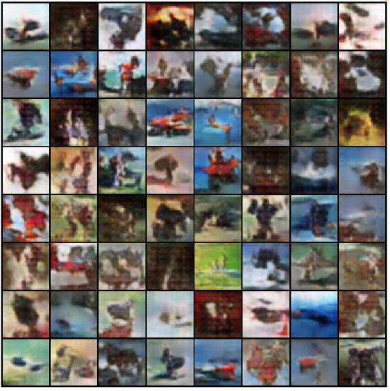

# PyTorch Lightning Bolts - GAN
This repo utilizes PyTorch Lightning Bolts DCGAN object and its CLI-based training script.

## Install the Virtual Environment
```
python3 -m venv bolts
source .bolts/bin/activate
pip install -r requirements.txt
```

## Running the Script.
The training script has the following options.
```
usage: train.py [-h] [--batch_size BATCH_SIZE] [--dataset {cifar10,mnist}] [--data_dir DATA_DIR]
                [--image_size IMAGE_SIZE] [--num_workers NUM_WORKERS]

optional arguments:
  -h, --help            show this help message and exit
  --batch_size BATCH_SIZE
  --dataset {cifar10,mnist}
  --data_dir DATA_DIR
  --image_size IMAGE_SIZE
  --num_workers NUM_WORKERS
```

For instance, to run the model on MNIST dataset with GPU, run the following:
```
python train.py --dataset mnist --gpus 1
```

## Experimental Results
### CIFAR-10
| Latent Space | Generated Image |
| ------------ | --------------- |

 | 

 ### MNIST
 | Latent Space | Generated Image |
 | ------------ | --------------- |

 | 